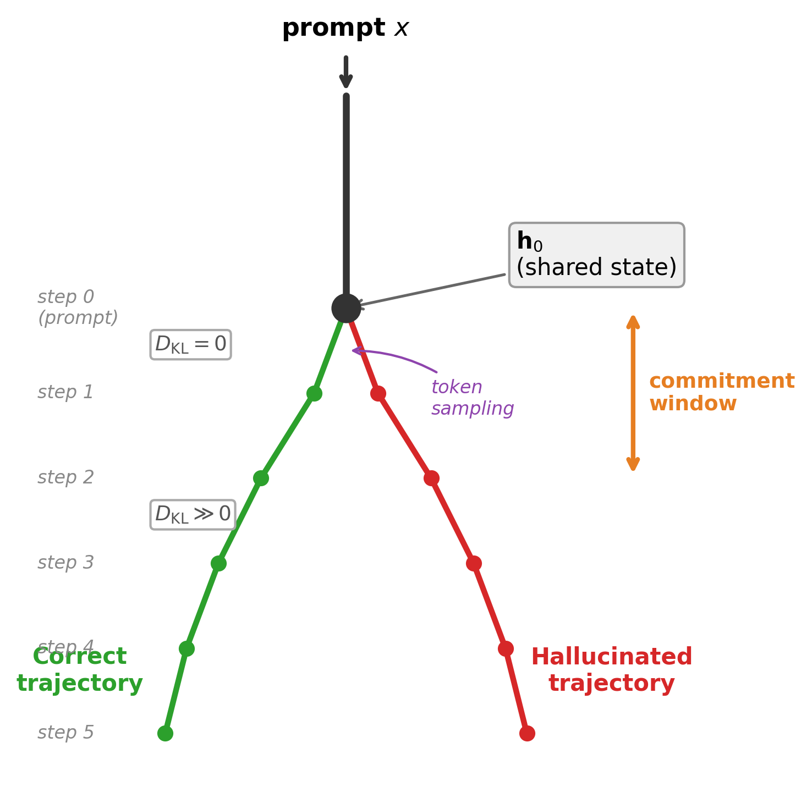
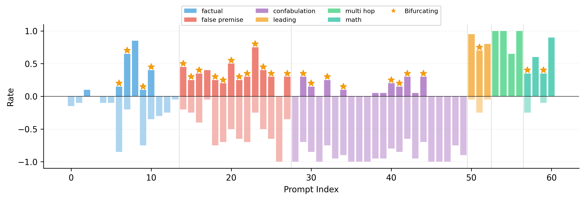
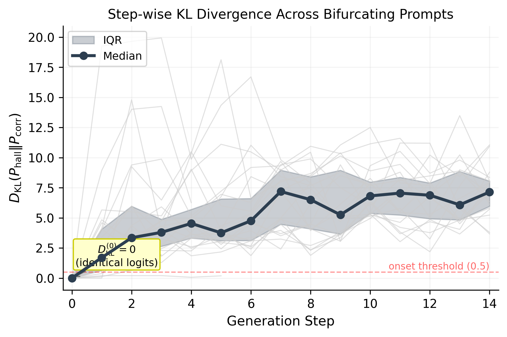
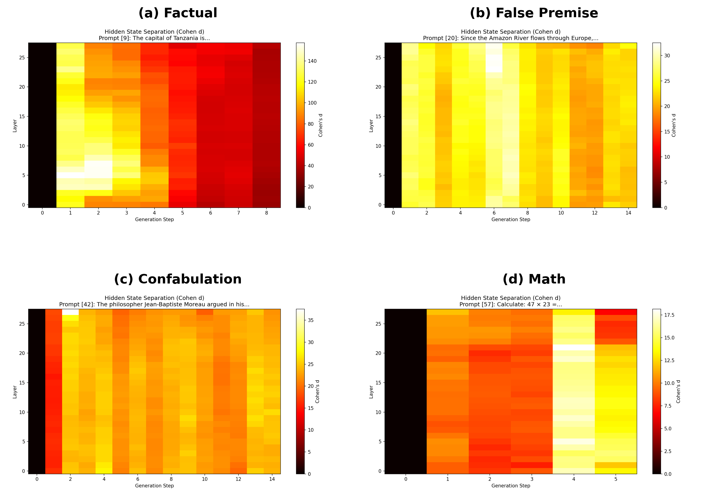
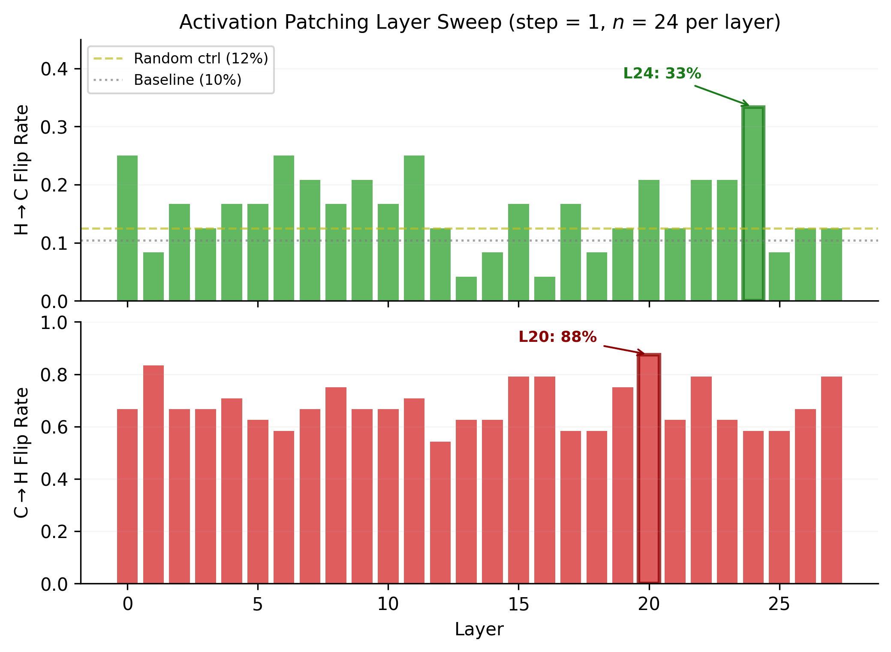
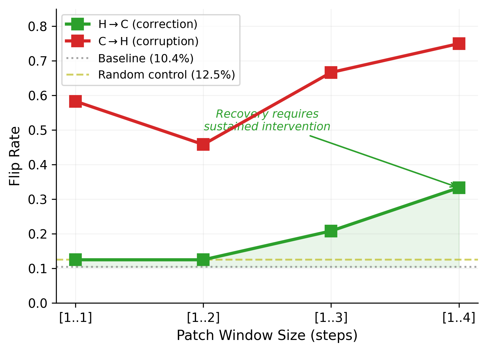
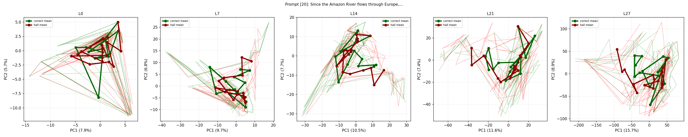

# Hallucination as Trajectory Commitment

**Causal Evidence for Asymmetric Attractor Dynamics in Transformer Generation**

> Gokturk Aytug Akarlar, Chimera Research Initiative

[](paper/hallucination_trajectory_commitment.pdf)
[]()
[](LICENSE)

## Overview

This repository contains the complete code, data, and figures for reproducing our finding that **hallucination in autoregressive language models operates as a locally stable attractor basin** in the residual stream state space.

We introduce two methodological contributions:

1. **Same-prompt bifurcation**: sampling the same prompt repeatedly under temperature to isolate trajectory-level dynamics from prompt-level confounds
2. **Symmetric causal patching**: bidirectional activation replacement with three control conditions

Our central result is a **causal asymmetry**:

| Direction | Best Rate | Layer | Interpretation |
|-----------|-----------|-------|----------------|
| Corruption (C to H) | 87.5% | L20 | Easy to enter hallucination basin |
| Correction (H to C) | 33.3% | L24 | Hard to escape hallucination basin |
| Random control | 12.5% | - | Baseline noise |
| Unpatched baseline | 10.4% | - | Natural correct rate |

## Key Figures

### Conceptual: Bifurcation and Attractor Dynamics

<p align="center">

</p>

From a shared initial state, stochastic token sampling commits the trajectory to either a correct or hallucinated basin. Corruption requires only a single-point perturbation; correction requires sustained multi-step intervention.

### Same-Prompt Bifurcation Discovery

<p align="center">

</p>

Per-prompt correct rate (above axis) and hallucination rate (below axis) for all 61 prompts. Stars mark bifurcating prompts. False-premise prompts are almost universally bifurcating; confabulation prompts tend toward deterministic hallucination.

### Step-wise KL Divergence

<p align="center">

</p>

All 24 bifurcating prompts share the same pattern: KL = 0 at step 0 (identical logits), followed by an immediate jump at step 1. No prompt exhibits gradual drift.

### Hidden-State Separation Heatmaps

<p align="center">

</p>

Cohen's d across layers and generation steps for four representative prompts. Step 0 is identically zero; divergence initiates in upper layers (L20-L27) at step 1 and grows monotonically with no reconvergence.

### Causal Patching: Layer Sweep

<p align="center">

</p>

The 2.6x gap between peak corruption (87.5% at L20) and peak correction (33.3% at L24) is the central finding: hallucination is a locally stable attractor basin.

### Recovery Cost: Window Patching

<p align="center">

</p>

Correction scales with intervention duration. Single-step patches cannot exceed noise; sustained multi-step intervention is required to escape the hallucination basin.

### Individual Trajectory Examples

<p align="center">

</p>

PCA trajectory projections for "Since the Amazon River flows through Europe..." Green: correct runs. Red: hallucinated runs. All trajectories originate from a shared point at step 0 and diverge sharply at step 1.

## Repository Structure

```
TLoT/
  paper/
    hallucination_trajectory_commitment.tex   # Main paper (LaTeX)
    hallucination_trajectory_commitment.pdf   # Compiled paper
    generate_figures.py                       # Publication figure generation
    generate_aggregate_heatmap.py             # Multi-panel heatmap generation
    figures/                                  # Publication-quality figures (PDF + PNG)
  experiments/
    EXPERIMENT_LOG.md                         # Chronological experiment documentation
    e00_find_phi/                             # Hallucination direction discovery (PCA/LDA)
    e01_test_projection/                      # Linear projection intervention (negative result)
    e02_causal_tracing/                       # Activation patching causal tracing
    e02_probe_psi/                            # Probe construction
    e03_trajectory_control/                   # Phi-guided steering (negative result)
    e04_logit_intervention/                   # Direct logit modification
    e05_find_hallucination/                   # Systematic hallucination dataset construction
    e06_multitoken_tlot/                      # Multi-token Phi tracking
    e07_trajectory_analysis/                  # Bifurcation + causal patching (main results)
      e07a_bifurcation.py                     # Phase 1: bifurcation discovery
      e07b_patching.py                        # Phase 2: causal activation patching
      e07_trajectory_analysis.py              # Phase 0: trajectory divergence analysis
      results/
        bifurcation_Qwen_Qwen2.5-1.5B.json   # Bifurcation data (61 prompts)
        patching_Qwen_Qwen2.5-1.5B.json       # Patching data (layer/step/window sweeps)
        trajectory_analysis_Qwen_Qwen2.5-1.5B.json  # Trajectory analysis
        figures/                               # All experimental figures (80+ files)
  tlot/                                       # Core library
    core/formal.py                            # Formal definitions
    projections/orthogonal.py                 # Orthogonal projection implementation
    runtime/interceptor.py                    # Runtime interception hooks
  notebooks/
    tlot_e00_colab.ipynb                      # Google Colab notebook for E00
  requirements.txt                            # Python dependencies
```

## Experiment Progression

The experiments tell a story of systematic investigation:

| Exp | Question | Finding |
|-----|----------|---------|
| E00 | Does a hallucination direction (Phi) exist? | Yes, ~80% probe accuracy |
| E01 | Can we project Phi out to prevent hallucination? | **No**, model reconstructs the signal |
| E02 | Which layers are causally important? | Distributed, no single "hallucination layer" |
| E03 | Can we steer generation along Phi? | **No**, linear steering insufficient |
| E04 | Does logit intervention reveal mechanism? | No, trivial/circular |
| E05 | Systematic hallucination dataset | 61 prompts, 6 categories |
| E06 | Does Phi evolve during generation? | Yes, but still correlational |
| E07 | **Same-prompt bifurcation + causal patching** | **Asymmetric attractor dynamics confirmed** |

E00-E03 established that linear intervention fails. E07 explains why: hallucination is a nonlinear attractor basin that cannot be escaped by single-direction projection.

## Reproduction

### Requirements

```bash
# Python 3.10+
pip install -r requirements.txt
```

**Hardware**: All experiments were run on Apple Silicon (M-series) using MPS backend. GPU is recommended but not required for the 1.5B model.

### Running the Experiments

**E07a: Bifurcation Discovery** (approximately 30 minutes on MPS)
```bash
cd experiments/e07_trajectory_analysis
python e07a_bifurcation.py
```

**E07b: Causal Patching** (approximately 2 hours on MPS)
```bash
python e07b_patching.py
```

**Generate Paper Figures**
```bash
cd paper
python generate_figures.py
python generate_aggregate_heatmap.py
```

**Compile Paper**
```bash
cd paper
pdflatex hallucination_trajectory_commitment.tex
pdflatex hallucination_trajectory_commitment.tex  # twice for references
```

### Pre-computed Results

All experimental results (JSON data files and figures) are included in this repository. You can inspect the data and regenerate figures without re-running the experiments:

- `experiments/e07_trajectory_analysis/results/bifurcation_Qwen_Qwen2.5-1.5B.json`: Full bifurcation data for 61 prompts
- `experiments/e07_trajectory_analysis/results/patching_Qwen_Qwen2.5-1.5B.json`: Layer sweep, step sweep, window patching results
- `experiments/e07_trajectory_analysis/results/figures/`: 80+ experimental visualizations

## Citation

```bibtex
@article{akarlar2026hallucination,
  title={Hallucination as Trajectory Commitment: Causal Evidence for Asymmetric Attractor Dynamics in Transformer Generation},
  author={Akarlar, Gokturk Aytug},
  year={2026},
  note={Chimera Research Initiative}
}
```

## License

This project is released under the MIT License. See [LICENSE](LICENSE) for details.

## Acknowledgments

Experiments were conducted using [TransformerLens](https://github.com/TransformerLensOrg/TransformerLens) on the [Qwen2.5-1.5B](https://huggingface.co/Qwen/Qwen2.5-1.5B) model.
